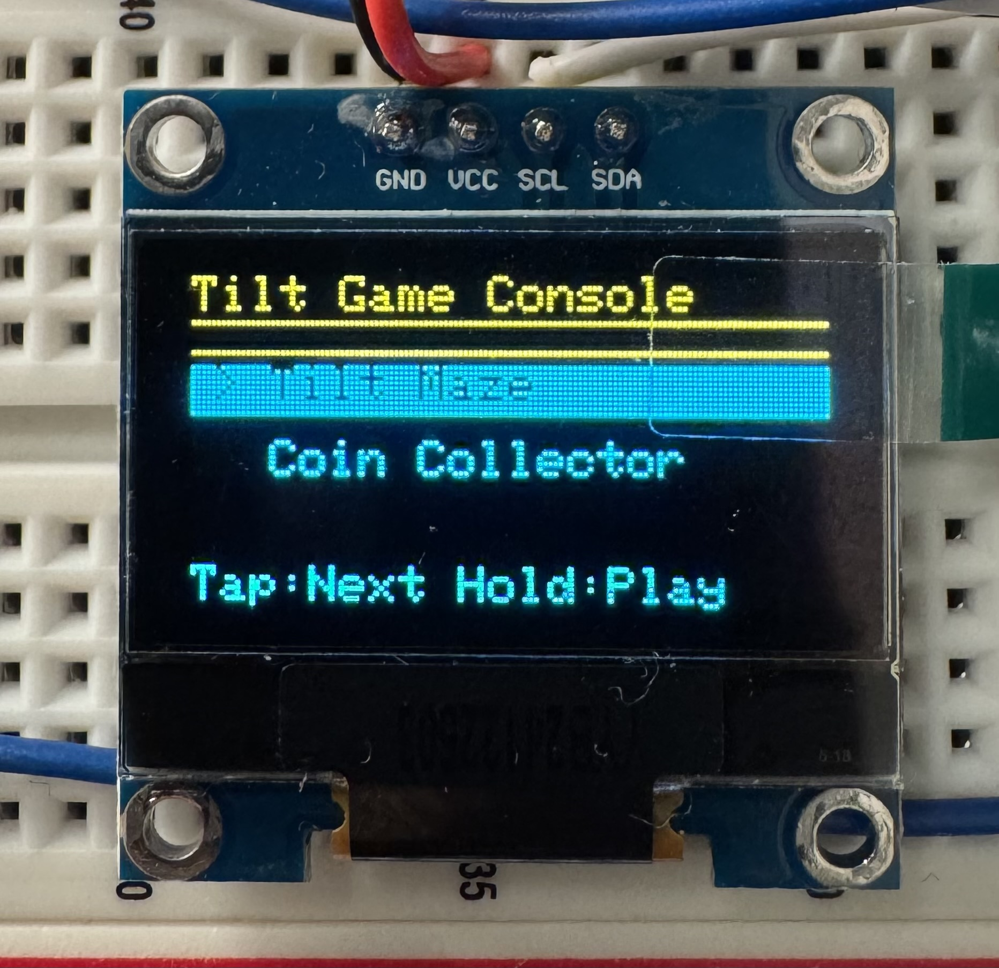
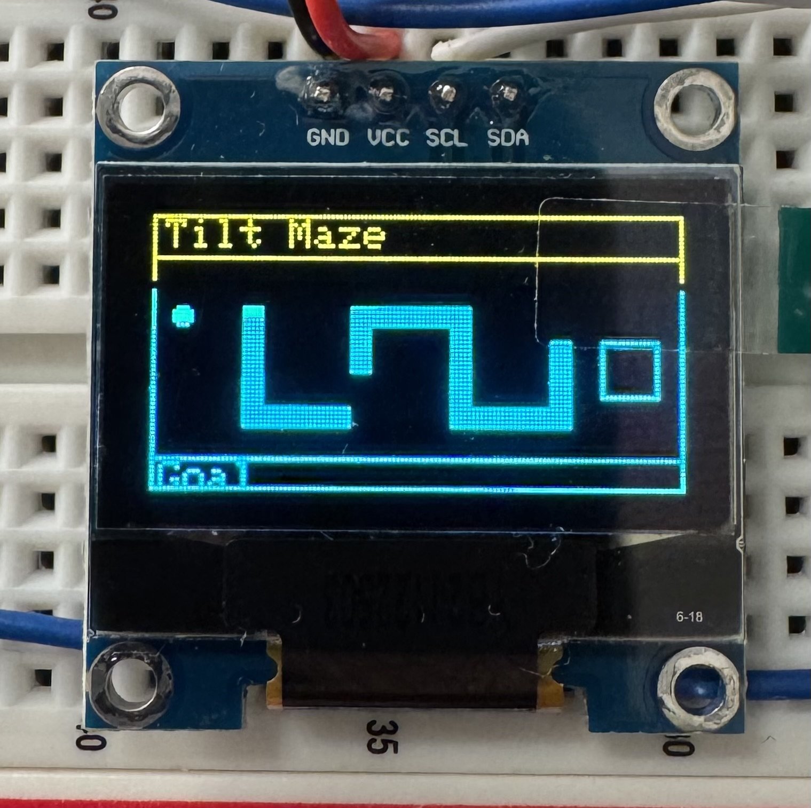
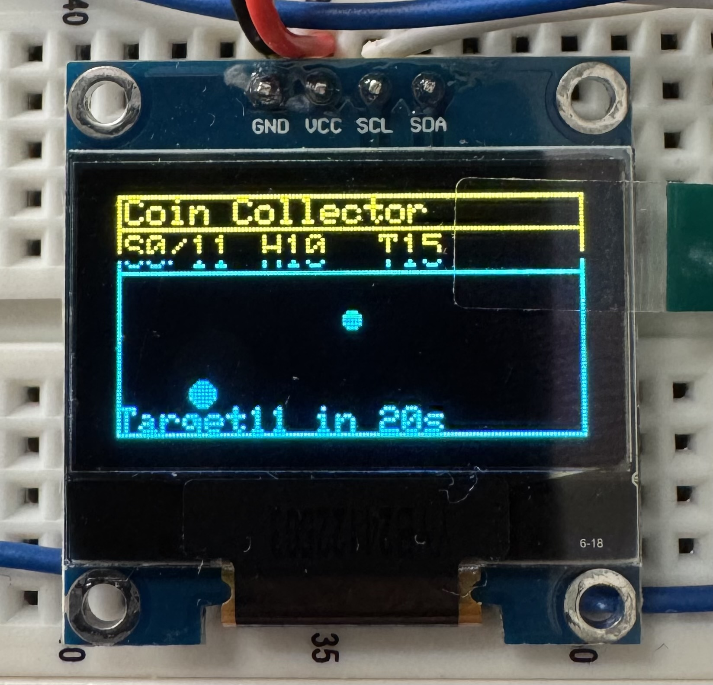
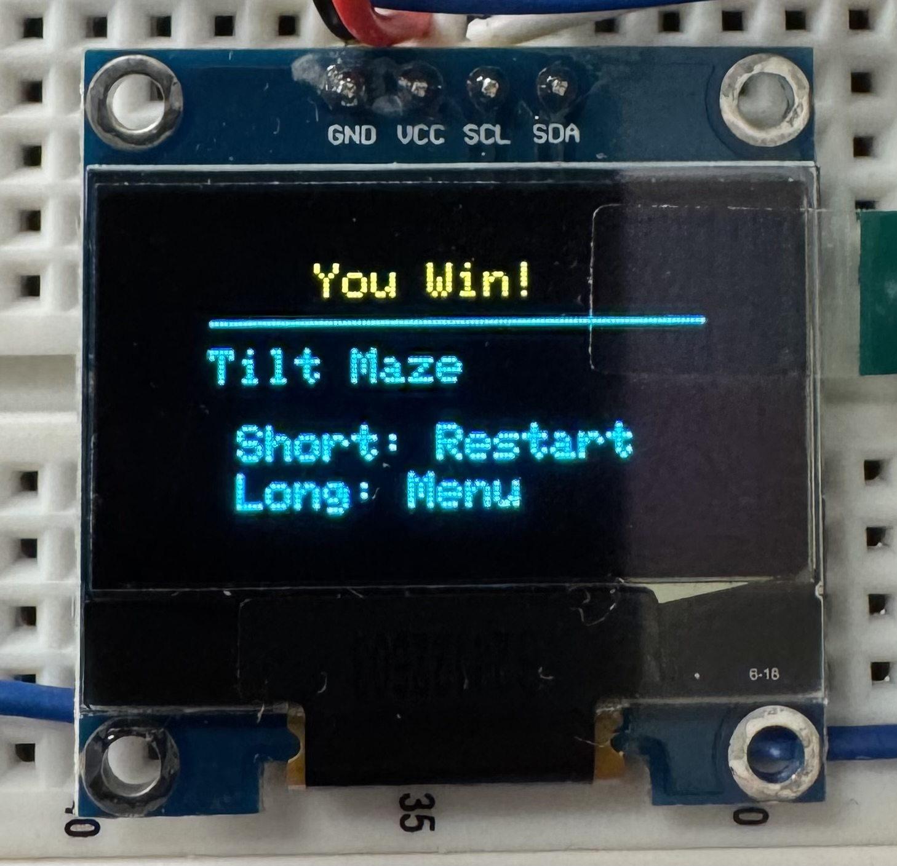
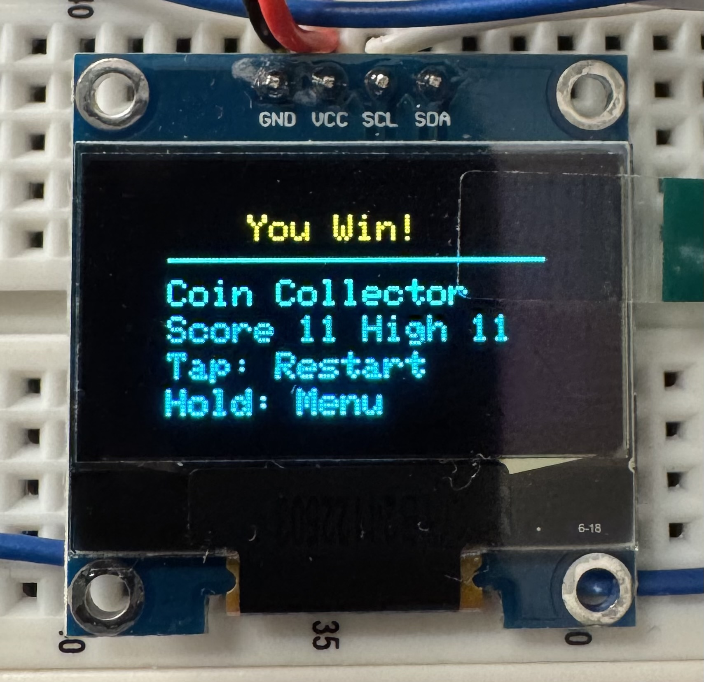
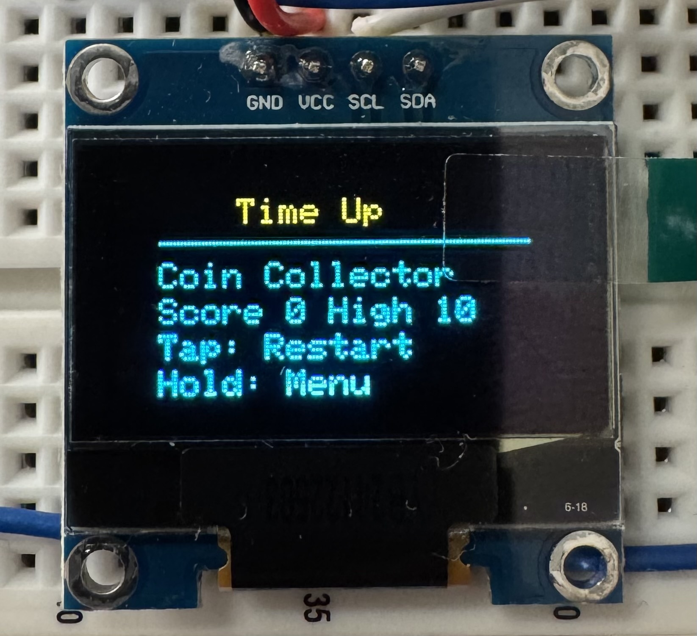
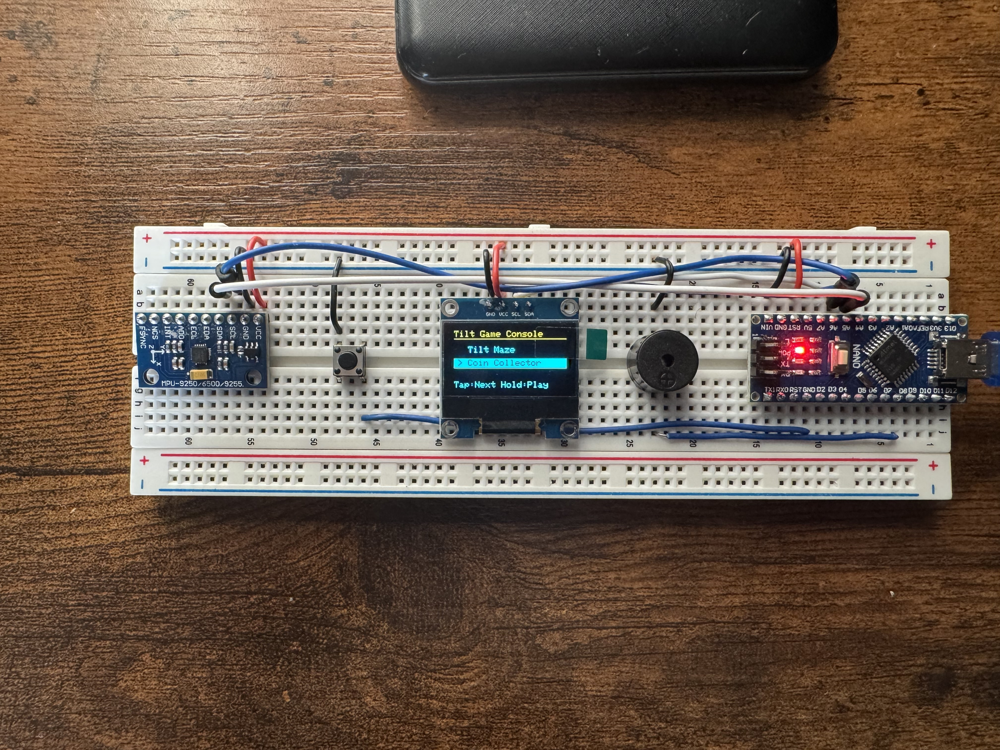

# Arduino Tilt Game Console

A tilt-controlled mini game console built with an Arduino Nano, a 128x64 OLED display, an MPU-6500-family motion sensor, a push button, and a buzzer.

The final build includes two playable games:
- `Tilt Maze`
- `Coin Collector`

## Project Overview

This project turns a simple Arduino breadboard build into a small motion-controlled game console. The player tilts the console to move a ball on screen, uses a single push button to navigate menus and restart games, and gets audio feedback from a passive buzzer.

The system boots into a menu, lets the player choose a game, and then runs one of two experiences:
- `Tilt Maze`: guide the ball through a maze and reach the goal
- `Coin Collector`: collect coins before time runs out and beat the saved high score target

## Features

- Tilt-based control using an MPU-6500-family motion sensor
- OLED menu with two games
- Single-button short press / long press navigation
- Buzzer feedback for menu moves, selection, coin collection, wins, and game over
- Playable `Tilt Maze`
- Playable `Coin Collector`
- EEPROM high score saving for `Coin Collector`
- Built with PlatformIO for reproducible setup and library management

## Demo / Images

### Main menu



### Gameplay




### End screens





### Wiring / Build photo



If you record a short GIF or demo video later, add it near the top of this section.

## Hardware Used

- Arduino Nano (`ATmega328P`)
- 0.96" I2C OLED display (`128x64`, SSD1306-style)
- MPU-6500-family motion sensor module
- Passive buzzer
- Push button
- Breadboard
- Jumper wires
- USB cable

## Wiring Summary

### OLED

- `GND -> GND`
- `VCC -> 5V`
- `SDA -> A4`
- `SCL -> A5`

### Motion Sensor

- `GND -> GND`
- `VCC -> 5V`
- `SDA -> A4`
- `SCL -> A5`

### Push Button

- one leg -> `D2`
- other leg -> `GND`
- code uses `INPUT_PULLUP`, so pressed = `LOW`

### Passive Buzzer

- positive -> `D9`
- negative -> `GND`

## How It Works

At startup, the Arduino:
1. Initializes the OLED, buzzer, button, and motion sensor
2. Detects the IMU over I2C
3. Calibrates a neutral tilt position
4. Opens the game selection menu

During use:
- short press moves to the next game in the menu
- long press starts the selected game
- tilting the console moves the player ball
- short press on end screens restarts the current game
- long press on end screens returns to the menu

### Tilt Maze

The ball moves through a drawn maze. Collision checks stop it from passing through walls. Reaching the goal box triggers a win.

### Coin Collector

The ball moves around the screen collecting coins. Each collected coin plays a sound and increments the score. The player must reach the round target before the time limit runs out. The highest score is saved in EEPROM.

## Software / Libraries

This repository is set up as a **PlatformIO** project.

### PlatformIO dependencies

- `adafruit/Adafruit SSD1306`
- `adafruit/Adafruit GFX Library`

### Built-in Arduino / framework libraries used

- `EEPROM`
- `Wire`

### Earlier libraries not used in the final build

- `adafruit/Adafruit MPU6050`
- `adafruit/Adafruit Unified Sensor`

## Getting Started

### Requirements

- Visual Studio Code
- PlatformIO IDE extension
- Arduino Nano connected by USB

### Open the project

Clone the repository and open it in VS Code:

```bash
git clone <your-repo-url>
cd arduino-tilt-game-console
```

### Build

Use the PlatformIO build button or run:

```bash
pio run
```

### Upload

Use the PlatformIO upload button or run:

```bash
pio run --target upload
```

### Serial Monitor

Open the PlatformIO Serial Monitor or run:

```bash
pio device monitor
```

## Project Structure

```text
src/main.cpp        Main game logic, menu, IMU handling, rendering, sounds
platformio.ini      PlatformIO configuration and dependencies
README.md           Project overview and setup instructions
docs/images/        Recommended location for screenshots and build photos
```

## Notes / Limitations

- The sensor handling is tuned for the physical orientation used in this build.
- The motion sensor support is custom for an MPU-6500-family device rather than a standard MPU6050 library setup.
- The OLED module used has a yellow top band and blue lower area, which is normal for some displays.
- `Avoid Holes` was removed from the final version because it was not completed.
- Flash memory usage is relatively high, so large extra features would need careful optimization.

## Future Improvements

- Add a second maze level or difficulty mode
- Add simple transitions or animations
- Improve Coin Collector visuals
- Add a proper wiring diagram graphic
- Add a short gameplay GIF or demo video

## License

This project is licensed under the MIT License. See [LICENSE](LICENSE).
